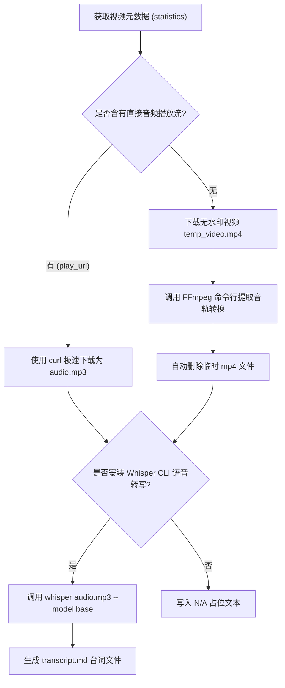

# 抖音视频解析器数据抓取与转写全链路原理解析

本技能文档旨在详细拆解 `抖音视频解析器_v1.0.py`（以及该独立版 `douyin_parser.py`）是如何解析和抓取抖音数据的。

---

## 一、 数据抓取底层技术原理 (Technical Core)

解析器能获取无水印视频、音频原声、播放量和点赞量，主要依赖于以下三个核心机制：

### 1. 短链智能解析重定向 (Redirect Probe)
当用户从抖音 App 复制分享链接时，拿到的是类似 `https://v.douyin.com/abcde12/` 的短网址。解析器首先需要将其解析为真实长网址：
*   **方法**：使用 `curl -s -I -L` 模拟真实浏览器 User-Agent 向该短链接发起 `HEAD` 请求。
*   **提取**：通过正则捕获 HTTP 响应头中的 `Location:` 跳转记录。
*   **识别**：获取跳转后的真实长 URL。
    *   若长 URL 中包含 `share/user/[sec_user_id]`，则标记该请求为**“博主主页拉取”**模式。
    *   若长 URL 中包含 `/video/[video_id]`，则标记该请求为**“单视频解析”**模式。

### 2. 免 Cookie 单视频解密 (window._ROUTER_DATA 网页盾提取)
当解析单个视频链接时，为了绕过风控，解析器不直接请求 API，而是走 Web 端页面免 Cookie 静态解密：
*   **目标地址**：请求 `https://www.iesdouyin.com/share/video/[video_id]`。
*   **数据盾解密**：抖音会在该页面的 HTML 源码中，将当前视频的所有数据反序列化后写入全局变量 `window._ROUTER_DATA` 中：
    ```html
    <script>window._ROUTER_DATA = {"loaderData":{"video_(id)/page":{"videoInfoRes":{"item_list":[{...}]}}}};... </script>
    ```
*   **正则获取**：解析器使用正则表达式 `r"window\._ROUTER_DATA\s*=\s*(.*?)</script>"` 直接把这个 JavaScript 对象切片出来，并通过 `json.loads` 转换为 Python 字典。
*   **字段提取**：在该字典中能够 100% 提取出视频无水印播放源（`play_addr`）、背景音乐原声流（`music.play_url`）、播放量（`play_count`）、点赞量（`digg_count`）和博主昵称（`nickname`）。

### 3. 多平台 API 路由与 Cookie 加密 (API Fetching)
对于批量拉取主页作品的请求：
*   **API 结构**：请求 `/api/douyin/web/fetch_user_post_videos?sec_user_id=[sec_uid]&count=[N]`。
*   **路由机制**：优先请求公共 Evil0ctal 接口服务器（如 `api.douyin.wtf`），若受限则尝试请求用户本地部署的 `localhost:8080` 服务。
*   **Cookie 绕过**：如果博主主页被设为私密或开启了高强度反爬，允许在 `curl` 请求头中挂载用户在浏览器中登录后拿到的 `Cookie`，该 Cookie 会包含 `ttwid` 等反爬检验因子，从而顺利拿到主页 JSON 列表。

---

## 二、 媒体下载与转码机制 (Media & Transcription Flow)

在获取到 JSON 数据后，解析器将启动媒体处理引擎：



### 1. FFmpeg 音轨分离
如果抖音视频的原声受版权限制无法直接提供 `audio_url`，解析器会下载无水印的 `video_url`（通过把播放地址中的 `playwm` 替换成 `play`），并使用以下命令提取高保真 MP3：
```bash
ffmpeg -y -i temp_video.mp4 -vn -acodec libmp3lame -q:a 2 audio.mp3
```

### 2. Whisper ASR 台词识别
一旦获得 `audio.mp3`，脚本会调用本地安装的 OpenAI Whisper 进行全语谱中文识别，将其逐句记录为文案，输出成 `transcript.md`，用于对标文案学习和指纹建模。

---

## 三、 使用操作步骤 (Operations)

### 1. 前置依赖安装
使用前请确保安装了 `ffmpeg`：
*   macOS: `brew install ffmpeg`
*   Windows: 下载 FFmpeg 官网包并将 `bin/` 添加至系统 PATH。

安装 Whisper 转写依赖：
```bash
pip install -r requirements.txt
```

### 2. 命令行使用样例
*   **解析并下载视频（包含统计量和台词）**：
    ```bash
    python3 douyin_parser.py --url "https://v.douyin.com/xxxxxx/"
    ```
*   **采集主页最近 3 篇视频并自动转录**：
    ```bash
    python3 douyin_parser.py --url "https://v.douyin.com/yyyyyy/" --count 3
    ```
*   **挂载本地 Cookie 文件抓取（提高主页拉取成功率）**：
    ```bash
    python3 douyin_parser.py --url "https://v.douyin.com/yyyyyy/" --cookie-file ./cookie.txt
    ```
